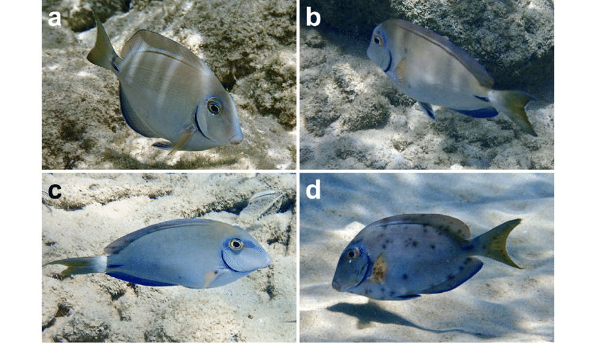
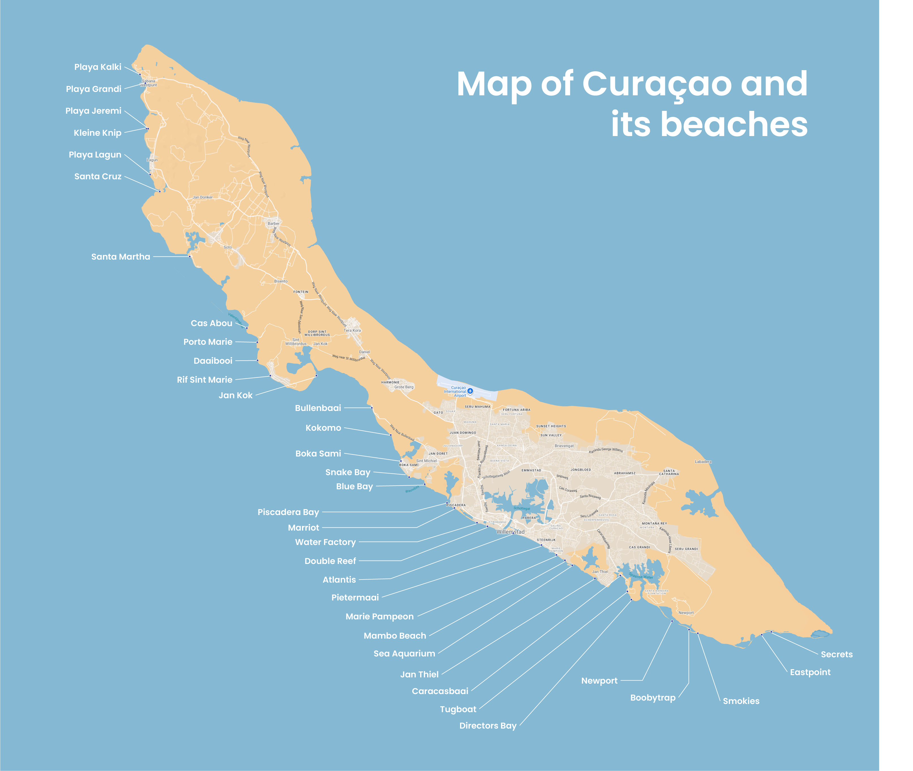
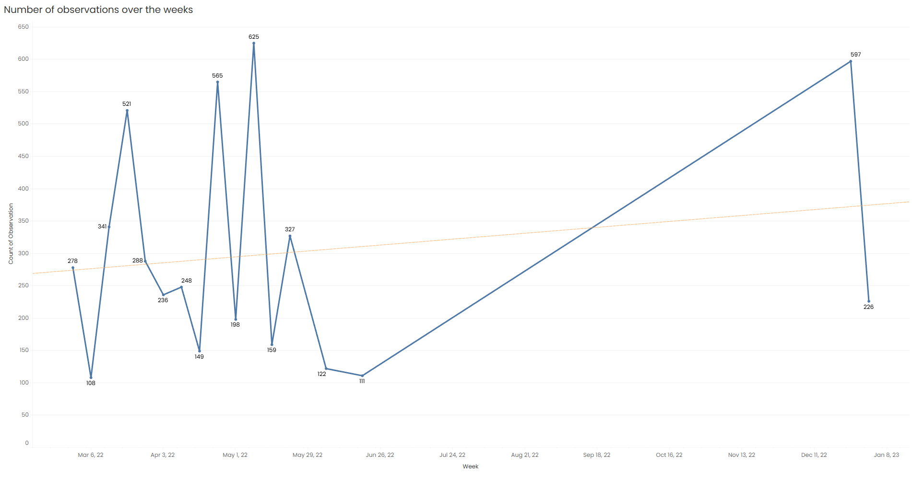
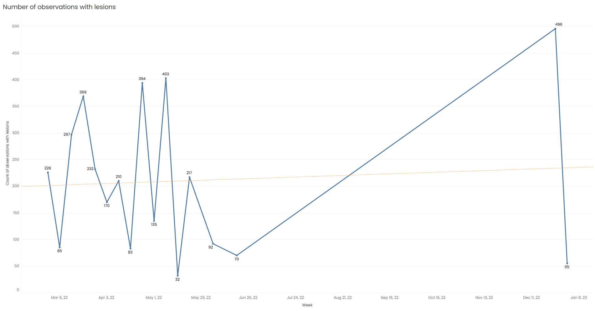
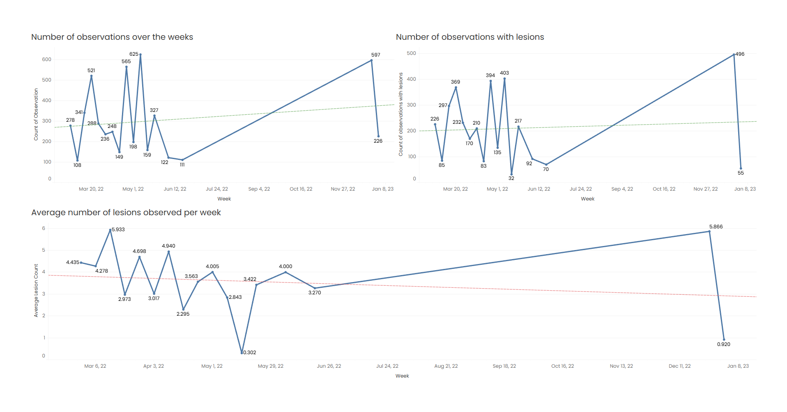
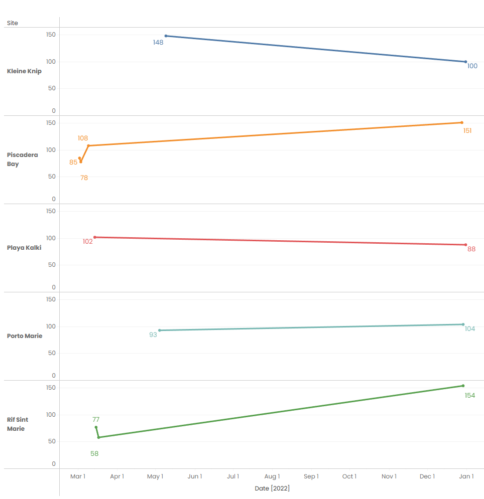
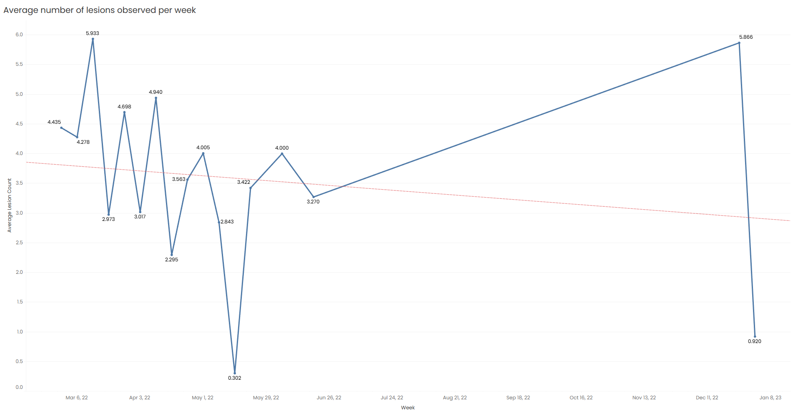

# 🐠 Introduction:
This is a SQL training exercise where I use a dataset on individual ocean surgeonfish *(Acanthurus tractus)* observed in 2022 during SCUBA transects around the island of Curaçao in the Caribbean. 
It contains information on the number of lesions (seen as black spots) on one side of each fish caused by trematode infection *(Scaphanocephalus expansus)*.

*Credit: de Wit, Cheyenna; Johnson, Pieter (2024). fish.csv. figshare. Dataset. https://doi.org/10.6084/m9.figshare.25471969.v1*
*Image of infection: uploaded by Zachary F Kohl.*

As with all good analysis, we must start by asking some good questions:
- Where and when are there the most number of observations (all observations, lesions or not)?
- Where and when are the lesions most spotted?
- How bad do they get (highest number of lesions per fish), where and when?
- Has the number of lesions spread over time or over geographic zone?  

🕵️ Looking for my SQL queries? They’re here:\
*Disclaimer: You may find more basic and fun queries not seen in the final analysis made in order to train more.*

# 🛠️Tools used:
To explore and analyze the data, I used:

- SQL to query the database and extract key insights.
- PostgreSQL to manage the data.
- Visual Studio Code to run my queries.
- Tableau to vizualize the data.
- GitHub to share my work.

# 🔍Analysis: 
Before we can begin any analysis, we first need to take a closer look at our data and… humbly acknowledge a few flaws.

Firstly, we don’t have explicit information about observations where no ocean surgeonfish were present.\
Secondly, we’re missing key insights into how lesion occurrence changes over time at each site, since many sites weren’t observed consistently throughout the year.\
Lastly, any information about these fish has to be sourced from external references, which may not fully reflect the reality of the populations around Curaçao.

Here are some facts about the species:
- Acanthurus tractus typically lives in small groups of about 5–6 individuals, at depths ranging from 2 m to 25 m.
- They are usually found on coral and rocky reefs, rocky shores with sandy patches, and seagrass meadows.
- Longevity is correlated with water temperature rather than body size.
- The species Acanthurus Tractus is an open-water/pelagic egg scatterer, forming reproductive groups in the months from November to March.


## Where and when is there the most number of observations (all observations, lesions or not)?
It is helpful to find the number of observations per site, as we could eventually build off this in order to deepen our analysis. To vizualize more clearly, we  can keep the following map in mind:



With the following query, we can see that not all sites have an equal distribiution of observations. Some sites have had more observations than others, such as Piscadera Bay, Rif Sint Marie and Kleine Knip.
```sql
SELECT 
    site, 
    COUNT(*) AS num_observations
FROM fish_observations
GROUP BY 
    site
ORDER BY num_observations DESC;
```

The same could be said about finding the number of observations per month. With the following query, we can see that ocean surgeonfish are observed more frequently during certain periods of the year. The data shows the number of observations per month, and there is a clear difference between them.\
*For example, there were 1,536 observations in March, compared to just 233 in June.*
```sql
SELECT
    COUNT(observation_date) AS num_observations,
    EXTRACT(MONTH FROM observation_date) AS month
FROM fish_observations
GROUP BY month
ORDER BY month ASC;
```


This is what the data looks like when put in a graph. We can clearly see the number of observations plotted weekly slowly trending higher.



However, the truth is often more nuanced than it first appears, and looking at averages can give us a clearer picture. Using the following query, we can list each site along with its average number of observations.\
In other words: *On an average day, how many observations are recorded at each site?*
```sql
WITH daily_counts AS (
    SELECT 
        site, 
        observation_date, 
        COUNT(*) AS obs_per_day
    FROM fish_observations
    GROUP BY site, observation_date
)
SELECT
    site,
    ROUND(AVG(obs_per_day), 2) AS avg_observations_per_day
FROM daily_counts
GROUP BY site
ORDER BY avg_observations_per_day DESC;

```
We can see that the average number of observations per day varies significantly across sites. Locations such as Pietermaai, Blue Bay, and Tugboat show noticeably higher daily averages compared to others *(even more than our usual suspects Piscadera Bay, Rif Sint Marie and Kleine Knip)*.

## Where and when are lesions most present?
The next query helped find the total lesion count per site.
```sql
SELECT 
    site,
    SUM(lesion_count) AS total_lesions
FROM fish_observations
GROUP BY site
ORDER BY total_lesions DESC;
```
The total lesion count seems correlated to sites that have had more Ocean surgeonfish observations than others. Once more, we can see that lesions are most present in sites such as Piscadera Bay, Rif Sint Marie and Kleine Knip.

The next query helped find the total lesion count per month.
```sql
SELECT
    SUM(lesion_count) AS total_lesions,
    EXTRACT(MONTH FROM observation_date) AS month
FROM fish_observations
GROUP BY month
ORDER BY month ASC;
```
This is what the data looks like when put in a graph. We can clearly see the number of lesions plotted weekly slowly trending higher.



Once more, I prefer looking at averages to get a better sense of the what the data is really saying. I used the following two queries to do just that! The first query is the average lesion count per month, and the second is the average lesion count per site.
```sql
SELECT
    ROUND(AVG(lesion_count),2) AS avg_lesions,
    EXTRACT(MONTH FROM observation_date) AS month
FROM fish_observations
GROUP BY month
ORDER BY month ASC;
```
```sql
SELECT 
    ROUND(AVG(lesion_count),4) AS avg_lesion_count,
    site
FROM fish_observations
GROUP BY site
ORDER BY avg_lesion_count DESC;
```
Lesions appear to be most common, on average, during the months of March and December. They are also most frequently observed at sites such as Rif Sint Marie, Playa Jeremi, and Porto Marie, each showing averages of over six lesions per fish.


## How bad do they get (highest number of lesions per fish), where and when?
The following query helps us find the maximum lesion count per site. We can see that the site with the highest lesion count is Porto Marie with 54 lesions!
```sql
SELECT 
    MAX(lesion_count) AS max_lesion_count,
    site
FROM fish_observations
GROUP BY site
ORDER BY max_lesion_count DESC;
```

And so it's no surprise that the date with the highest lesion count is associated to the observation in Porto Marie, which is the 29th December 2022.
```sql
SELECT 
    MAX(lesion_count) AS max_lesion_count,
    observation_date
FROM fish_observations
GROUP BY observation_date
ORDER BY max_lesion_count DESC;
```

## Has the number of lesions spread over time or over geographic zone?

All of our queries give us a good starting point for analysis, but they also raise more questions. In any case, all data concerning "Where" and "When" the lesions appear, the observations occur and average lesion count can be vizualized in the following graph:



I have also plotted the lesion count of sites against the time in days. The sites shown are the only sites in the dataset that have multiple observations across time. 



We can observe that in some areas, like Piscadera Bay or Rif Sint Marie, we can see lesions **increasing** over time, while in places like Playa Kalki or Klein Knip, the numbers seem to be **decreasing** or stabilizing. On the whole, there’s a general trend of fewer lesions being observed across these sites.\
For all other sites, there seems to be no pattern. It would seem that we cannot conclude that the number of lesions spreads across geographic zones. 

We should keep in mind that we only have a year’s worth of data. So, is the decline of observations because there are fewer visible instances of infection later in the year, or because there are simply fewer surgeonfish around at that time?\
Most likely, it’s a bit of both: fewer fish in total with fewer lesions observed. This can be backed up by the fact that Acanthurus Tractus is a pelagic egg scatterer, reproducing in open waters in the months from November to March.


However, when we take a closer look at the chart showing average lesion counts, we notice a spike toward the end of the year. **The average number of observed lesions increases in December.** This might seem to contradict our previous point, but more importantly, it could indicate *underlying issues* or contributing factors that are not captured within the dataset.



# 🤔 Conclusion and Takeaway:
Total table with: site, number observations, % lesions. 


*So Long, and Thanks for All the Fish*
